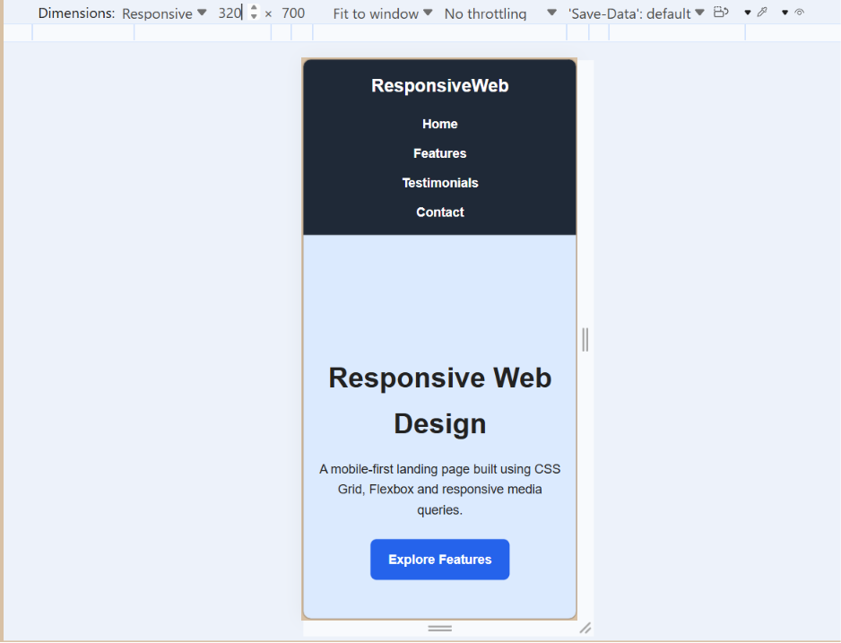
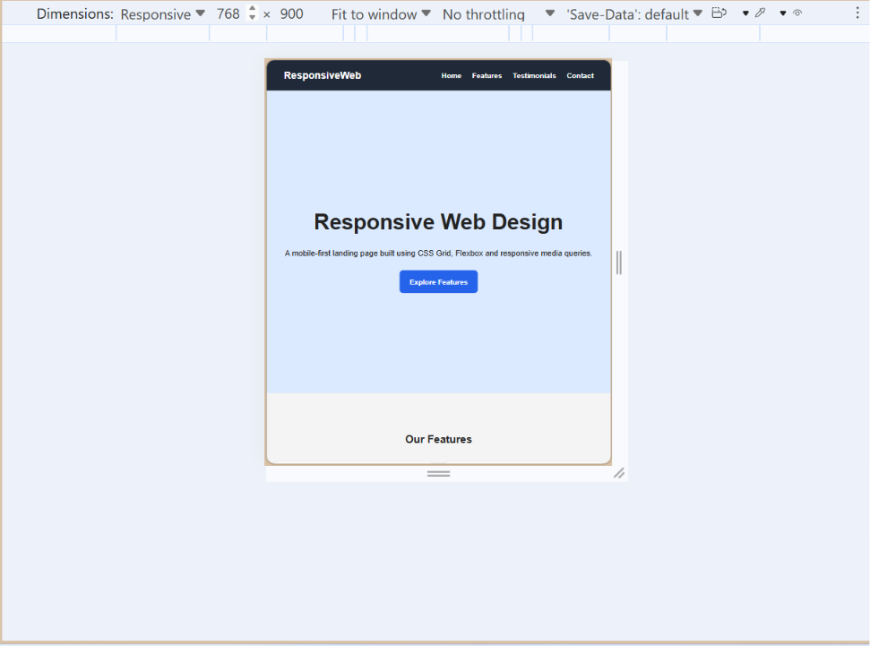
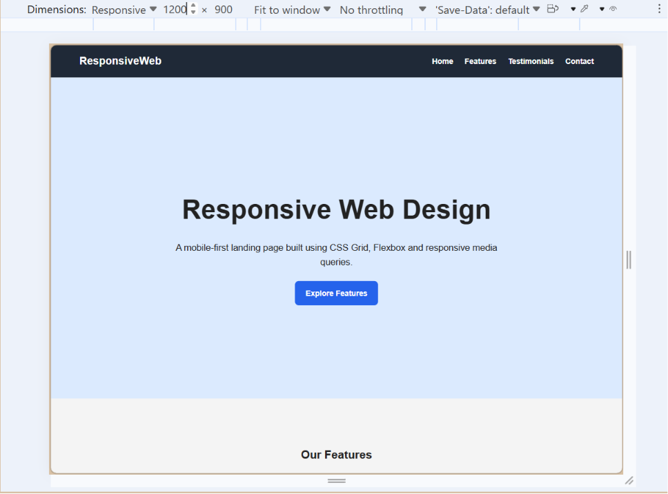

# Responsive Design — Week 2 Day 2

## Overview

A fully responsive, mobile-first landing page built using HTML5 and CSS3.

## Technologies Used

- HTML5
- CSS3
- CSS Grid
- Flexbox
- Media Queries
- Chrome DevTools

## Sections

- Hero
- Features
- Testimonials
- Footer

## Responsive Breakpoints

- 320px — Mobile
- 768px — Tablet
- 1024px — Desktop
- 1440px — Large Desktop

## Layout Techniques

- Flexbox is used for the navigation and testimonials.
- CSS Grid is used for the features section.
- Media queries adapt the layout for different screen sizes.
- The page follows a mobile-first approach.

## Chrome DevTools Testing

### 320px — Mobile

### 768px — Tablet

### 1440px — Desktop

